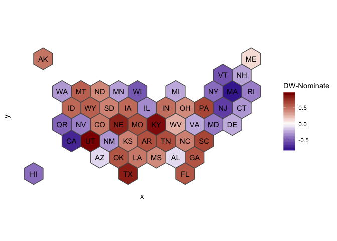
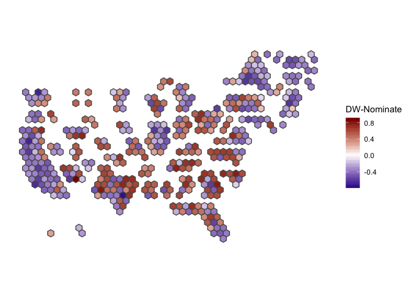

# electoral.hex

<!-- badges: start -->

<!-- badges: end -->

This is a package to make it easier to plot data using US state and
Congressional district Tilegram maps (especially from [Pitch
Interactive](https://pitchinteractiveinc.github.io/tilegrams/)).

This product uses the Census Bureau Data API but is not endorsed or
certified by the Census Bureau.

## Installation

``` r
# install.packages("devtools")
devtools::install_github("mattle24/electoral.hex")
```

## Example

This is a basic example which shows you how to solve a common problem:

``` r
library(magrittr)
library(ggplot2)
library(sf) # it is critical to load `sf`, otherwise reading in the .rds files will result in
#> Linking to GEOS 3.6.1, GDAL 2.1.3, PROJ 4.9.3
            # the geography column being understood as a list
library(electoral.hex)
library(politicaldata)

theme_set(theme_minimal())

# load in data for senate
dw_senate <- politicaldata::get_senate_nominate(116)
dw_senate <- dw_senate %>% # only one obs. per state
  dplyr::group_by(state_abbrev) %>%
  dplyr::top_n(1, born) %>%
  dplyr::ungroup()

# method one: manipulate the data.frame-like object to be mapped
plot_hex_states <- hex_states_join(dw_senate, state_key = "state_abbrev", state_key_type = "state_abb")

ggplot(plot_hex_states) +
  geom_sf(aes(fill = nominate_dim1)) +
  coord_sf(datum = NA) +
  geom_sf_text(aes(label = state_abbrev)) +
  scale_fill_gradient2(low = "darkblue", high = "darkred", name = "DW-Nominate")
```



``` r

# method two: manipulate the ggplot data
ggplot(data = dw_senate) %>%
  hex_states_join(state_key = "state_abbrev", state_key_type = "state_abb") +
  geom_sf(aes(fill = nominate_dim1)) +
  coord_sf(datum = NA) +
  geom_sf_text(aes(label = state_abbrev)) +
  scale_fill_gradient2(low = "darkblue", high = "darkred", name = "DW-Nominate")
```


``` r

# do the same things for Congress
dw_house <- politicaldata::get_house_nominate(116)

plot_hex_cd <- hex_cd_join(dw_house, district_key = "district_code", state_key = "state_abbrev",
                           state_key_type = "state_abb")

ggplot(data = plot_hex_cd) +
  geom_sf(aes(fill = nominate_dim1)) +
  coord_sf(datum = NA) +
  scale_fill_gradient2(low = "darkblue", high = "darkred", name = "DW-Nominate")
```



``` r

ggplot(data = dw_house) %>%
  hex_cd_join(district_key = "district_code", state_key = "state_abbrev", state_key_type = "state_abb") +
  geom_sf(aes(fill = nominate_dim1)) +
  coord_sf(datum = NA) +
  scale_fill_gradient2(low = "darkblue", high = "darkred", name = "DW-Nominate")
```


